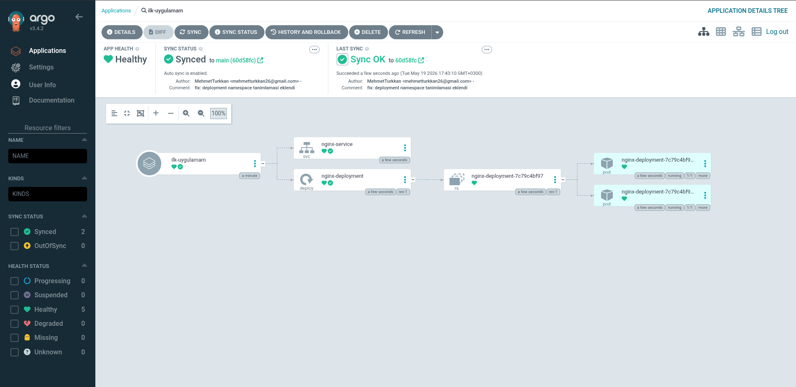

# 🚀 Local Kubernetes Cluster with GitOps (ArgoCD)

> **Kubeadm + Vagrant + Flannel + ArgoCD** kullanarak lokalde çok düğümlü bir Kubernetes kümesi kurma ve GitOps pipeline'ı oluşturma.


---

## 📌 Proje Amacı

Bu proje; konteyner orkestrasyonunu, cluster yönetimini ve modern dağıtım pratiklerini uygulamalı olarak öğrenmek amacıyla oluşturulmuştur.

**Hedefler:**
- Vagrant ile yerel sanal makine altyapısı kurmak
- `kubeadm` ile production benzeri çok düğümlü Kubernetes cluster'ı oluşturmak
- CNI eklentisi olarak **Flannel** ile pod ağını yapılandırmak
- **ArgoCD** ile GitOps pipeline'ı kurmak
- GitHub'daki her değişikliğin otomatik olarak cluster'a yansımasını sağlamak

---

## 🏗️ Mimari

```
┌─────────────────────────────────────────────────┐
│                   GitHub Repo                   │
│         (k8s-gitops-lab / my-app/*.yaml)        │
└───────────────────────┬─────────────────────────┘
                        │  Git poll / webhook
                        ▼
┌─────────────────────────────────────────────────┐
│              ArgoCD (argocd namespace)          │
│         Auto Sync + Prune + Self Heal           │
└───────────────────────┬─────────────────────────┘
                        │  kubectl apply
                        ▼
┌─────────────────────────────────────────────────┐
│         Kubernetes Cluster (local)              │
│                                                 │
│  ┌─────────────┐  ┌──────────┐  ┌──────────┐    │
│  │ master-node │  │ worker-1 │  │ worker-2 │    │
│  │ (Control    │  │          │  │          │    │
│  │  Plane)     │  │          │  │          │    │
│  └─────────────┘  └──────────┘  └──────────┘    │
│                                                 │
│  Network: Flannel (CNI)                         │
│  Runtime: containerd                            │
└─────────────────────────────────────────────────┘
```

---

## 🖥️ Altyapı


- **Host OS:** CachyOS (Arch tabanlı)
- **Guest OS:** Ubuntu 22.04 LTS
- **Sanallaştırma:** VirtualBox + Vagrant
- **Kubernetes:** kubeadm
- **Container Runtime:** containerd
- **CNI:** Flannel

---

## 📁 Repo Yapısı

```
k8s-gitops-lab/
├── Vagrantfile          # 3 VM'i tanımlayan Vagrant konfigürasyonu
├── setup.sh             # Kubernetes kurulum otomasyon scripti
├── my-app/
│   └── nginx.yaml       # Nginx Deployment + Service manifest'leri
└── README.md
```

---

## ⚡ Kurulum

### Gereksinimler

- [VirtualBox](https://www.virtualbox.org/) (>= 6.1)
- [Vagrant](https://www.vagrantup.com/) (>= 2.3)
- En az **8 GB RAM** ve **4 CPU** çekirdeği


### 1. Repoyu Klonla

```bash
git clone https://github.com/Mehmettrkkan/k8s-gitops-lab.git
cd k8s-gitops-lab
```

### 2. Sanal Makineleri Ayağa Kaldır

```bash
vagrant up
```

> İlk çalıştırmada Ubuntu box indirilir (~600 MB). Tüm kurulum `setup.sh` ile otomatik yapılır.

### 3. Cluster Durumunu Kontrol Et

```bash
vagrant ssh master
kubectl get nodes
```

Beklenen çıktı:
```
NAME       STATUS   ROLES           AGE   VERSION
master     Ready    control-plane   10m   v1.29.x
worker-1   Ready    <none>          8m    v1.29.x
worker-2   Ready    <none>          8m    v1.29.x
```

---

## 🔄 GitOps — ArgoCD Kurulumu

### ArgoCD'yi Kur

```bash
kubectl create namespace argocd
kubectl apply -n argocd -f https://raw.githubusercontent.com/argoproj/argo-cd/stable/manifests/install.yaml
```

### ArgoCD UI'ya Eriş

ArgoCD arayüzüne güvenli bir şekilde erişmek için Kubernetes'in yerleşik port-forwarding özelliğini kullanıyoruz:

```bash
# Başlangıç şifresini al
kubectl get secret argocd-initial-admin-secret -n argocd \
  -o jsonpath="{.data.password}" | base64 -d

# Doğrudan Deployment üzerinden tünel aç
kubectl port-forward deployment/argocd-server -n argocd 8080:8080
```

Tarayıcıdan `https://<master-ip>:<nodeport>` adresine git. Kullanıcı adı: `admin`

### Uygulamayı Bağla (UI Üzerinden)

1. **+ NEW APP** butonuna tıkla
2. Şu değerleri doldur:

| Alan | Değer |
|---|---|
| Application Name | `ilk-uygulamam` |
| Project | `default` |
| Sync Policy | `Automatic` |
| Prune Resources | ✅ |
| Self Heal | ✅ |
| Repository URL | `https://github.com/Mehmettrkkan/k8s-gitops-lab` |
| Revision | `main` |
| Path | `my-app` |
| Cluster URL | `https://kubernetes.default.svc` |
| Namespace | `default` |

3. **CREATE** → ArgoCD otomatik sync yapar

---

## 🚀 GitOps Pipeline Nasıl Çalışır?

```
Sen → git push → GitHub
                    ↓
              ArgoCD fark eder 
                    ↓
         kubectl apply (otomatik)
                    ↓
        nginx Cluster'da güncellenir ✅
```

Artık `my-app/nginx.yaml` dosyasında yaptığın **her değişiklik**, GitHub'a push etmen yeterli — geri kalanını ArgoCD halleder.

---

## ✅ Başarı Kriterleri
```markdown
**ArgoCD Canlı Dağıtım Ekranı:**


Projenin tamamlandığını şu göstergelerle doğrulayabilirsin:

| Kontrol | Komut | Beklenen |
|---|---|---|
| Node'lar hazır | `kubectl get nodes` | 3x `Ready` |
| Pod'lar çalışıyor | `kubectl get pods -n default` | `Running` |
| ArgoCD durumu | ArgoCD UI | `Healthy / Synced` |
| Flannel çalışıyor | `kubectl get pods -n kube-flannel` | `Running` |

**ArgoCD son durum:**


---

## 🎓 Öğrenilen Kavramlar

- **kubeadm** ile production-grade cluster kurulumu
- **Flannel CNI** ile pod networking
- **ArgoCD** ile GitOps ve sürekli deployment
- Kubernetes **Deployment**, **Service**, **Namespace** kaynakları
- **RBAC** ve ArgoCD yetkilendirme modeli
- **Self-healing** ve **auto-pruning** ile declarative state yönetimi


## 👤 Yazar

**Mehmet Türkkan**
- GitHub: [@Mehmettrkkan](https://github.com/Mehmettrkkan)

---

*Bu proje CKA sertifikası hazırlığı ve GitOps pratikleri öğrenmek amacıyla geliştirilmiştir.*